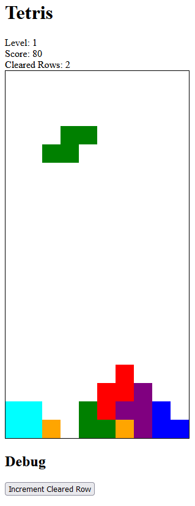

This is a simple Tetris game implemented in JavaScript made almost completely using code generated by OpenAI's ChatGPT. 

The full chat log with OpenGPT can be found in the docs [here](https://aadnk.github.io/TetrisChatGPT/docs/tetris-chatgpt-session.htm).

## Demo

You can play with the game [directly on Github Pages](https://aadnk.github.io/TetrisChatGPT).
